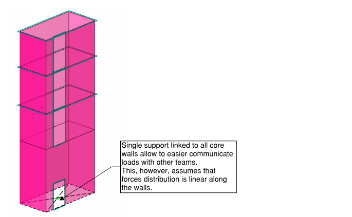
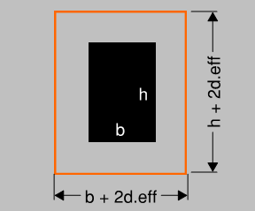

# Reinforced Concrete

The purpose of RC/steel and timber sections is to focus on modelling and design
challenges I have experienced relevant to specific material. 
Inevitably, the content in those sections are more tied to Eurocodes.
This section talks about **in-situ concrete buildings** and does not cover precast concrete or prestressed concrete.

## Considerations in overall model

Overall model (or multiple models) of the
building is usually used to design everything except the horizontal
elements -- slabs usually get designed separately.

The main considerations when doing static analysis to get internal
forces in columns and concrete core walls:

-   Will global second-order effects due to cracking and creep be
    relevant?
-   Should the foundation stiffness be accounted for?
-   Is axial shortening relevant?
-   Are there transfer beams or other elements affected by construction sequence?

For each of these effects, **you have three choices**:
1)  Justify that the impact on internal forces is negligible and ignore
    the effect;
2)  Do calculations with upper/lower bound stiffness for
    members/foundations/beams and use most onerous results of the two;
3)  Explicitly account for the effect -- detailed calculations.

I suggest that you think about **what is "special" about your
building**?

**First choice - ignoring effects**. If your RC building has up to 5-8
floors, traditional pad/pile footing, stability core and slab + beam
floors, and vertical columns/walls (i.e. no permanent horizontal forces)
then don't overcomplicate it:
-   Just use one linear static model with uncracked properties for
    stability/column design;

    {{
}}
(1) Linear analysis of element based on the theory of elasticity may be user for both the serviceability and ultimate limit states.\
(2) For the determination of the action effects, linear analysis may be carried out assuming: 
i) uncracked cross sections,  
ii) linear stress-strain relationships and  
iii) mean value of the modulus of elasticity 
    {{
}}

-   Separate models for slab & beam design -- one model per floor. The
    separate model allows for refined mesh size and neglect of axial
    shortening effects.
-   Check stability system calculations with manual calculation checks
    -- If your core is driven by size of stairs, it is likely to be
    lightly loaded.
-   Use supports without springs. [See Support modelling section](/docs/modelsupports/#modelling-foundations)

**Second choice - upper and lower bound stiffness** I believe this is a reasonable way to
go for complex buildings.

If you choose the option of considering upper/lower bound of
stiffnesses, multiple models may be required (unless some special
built-in features of FE software is used).\
So you likely need to find a way to find envelope forces of multiple
models.

**What are the typical upper/lower boundaries?**
-   Stiffness decrease due to cracking and creep:
    -   Upper bound -- uncracked mean elastic modulus of concrete;
    -   Lower bound -- accounting for cracking and creep by reducing
        stiffness 2-4 times.
-   Foundation stiffness:
    -   Upper bound - Translationally fixed supports;
    -   Lower bound -- Spring stiffness calculated using settlements of
        foundations;
-   Axial shortening:
    -   Upper bound - Assuming the columns are axially completely stiff.
        These results should compare well to the sum of reactions at
        separate models created for slab design;
    -   Lower bound - Modelling full model with assumption that all loads
        are applied at the same time.
-   Transfer beams:
    -   Upper bound -- assuming flexurally stiff beam. This can
        alternatively be done by placing supports at locations where beam
        supports columns above. And placing reactions of this support as a
        load on the beam.;
    -   Lower bound -- assuming stiffness reduced by cracking and creep. I
        personally would argue that only cracking should be considered,
        because creep happens in long term and only influences
        strains=deflections, not stresses in the beam.

**Third choice -- detailed analysis**. In my opinion, for
reinforced concrete, each of the considerations includes **variables that
are hard to estimate** at the start of the design (including construction programme and weather). Therefore, I have not
tried to explicitly capture all these considerations in a single
"precise" model. Saying that from a modelling/analysis perspective you
can still try to do that:
-   Use software, that modifies stiffness of stability system for creep
    and cracking. Alternatively, you can do multiple "iterations"
    yourself.
-   Calculate stiffness of foundations and use spring supports. You must
    trust these are neither too stiff or to floppy\...;
-   Do a staged analysis to explicitly calculate axial shortening
    effects and construction sequence. The most popular option might be
    "staged construction load case" in ETABS program.

## Stability design -- keeping it simple

In this short section, I just wanted highlight, that stability core is the
most important part of the building.

-   I strongly suggest you read [IStructE guides on "Stability of buildings"](https://www.istructe.org/resources/guidance/stability-of-buildings-3-volume-package/) before modelling and
    design work. These have a good advice on simplified assessment to ensure a robust solution.
-   **Make sure the design is conservative.**
    -   I strongly suggest that for design of stability core you assume
        hinges at the column ends and rely on core-only to ensure stability.
    -   I also suggest that you use a linear hinge at slab/core
        intersection, thus not relying on frame action at this connection.
    -   If you do find yourself "fighting" to get the core to get from those
        105% or 110% utilisation to just below 100%, **then there is something
        wrong** with your structural scheme or sizing. Can adding outrigger
        columns help?
-   Use result beams (see [section on results](/docs/results/)) to calculate overall results in
    building core, compare those with simple hand-calc using wind loads.
-   For modelling the supports of core walls, it is simpler to create
    single fixed support at the base. This allows to easy communicate
    loads.
{{
}}

{{
}}

## Stability design -- stiffness reduction due to cracking and creep

### Second-order effects caused by cracking and creep

This is a topic where a lot depends on engineering judgement. You may
disagree on the approach I am describing here. However, you must think
about and consider cracking, creep and second order effects.

In an overall model, second-order effects will be relevant for the
design of the stability system. And in simple terms, it will mean:
-   At **SLS**, the deflections will be larger, because:
    -   Some of the parts of the core wall might be in tension -- therefore
        have cracked and less stiff;
    -   If there are permanent lateral loads due to eccentric of building
        (or prestress), there will be creep effects.
    -   P-delta effect: as the core walls deflect from lateral actions,
        there is additional eccentricity created for vertical loads. P-delta
        effects are increased due to cracking and creep.

-   At **ULS**, the forces will be larger, because of this P-delta effect.

### About SLS - building sway

I suggest that you calculate the sway using elastic properties and
then:
-   For sway caused by wind - multiply the deflection by 2.0 to account
    for cracking
-   For sway caused by sustained lateral load (i.e. self-weight and SDL
    of eccentric building), multiply effects by (1 + creep).

#### Deflection caused by wind -- accounting for cracked section

Eurocode does not give a straight-forward advice regarding the
stiffness modification for cracked sections and creep:

-   EN 1992-1-1 Section 5.8.3.3 gives a simplified advice when can the second-order effects
    be ignored.
-   EN 1992-1-1 Section 5.8.7.2 provides general guidance.
    Note that in my experience using 5.8.7.2(3) advice for stiffness modification leads
    to similar stiffness reduction at ULS as ACI 318 would suggest
    (factor 0.3 to account for cracking compared to 0.35 in ACI318).
-   EN 1992-1-1 Annex H gives more information specifically on core walls;

American ACI318 gives a good simplified advice in sections 10.10.4.1
and 8.8.1. If you can depart from Eurocode for a bit, I suggest
using this advice.

ACI 10.10.4.1 provides reduced flexural stiffness properties at
"factored loads" (or ULS) state. And section 8.8.1 mentions that for
sway (SLS) checks these stiffness values can be multiplied by 1.4.
So -- for cracked walls, the modifier is 0.35 x 1.4 = 0.5. Or -- the
sway is twice larger than for uncracked stiffness.

{{
}}
Excerpt from [ACI318](https://www.concrete.org/tools/318buildingcodeportal.aspx.aspx)\

{{
}}

#### Sustained lateral loads causing sway - accounting for creep

Eurocode gives a good advice there. I won't delve into the
calculation of creep factors (enjoy the maze of code yourself), but
I expect the creep.ef to be around 1.5-2.0, and thus the overall
increase factor to be 2.5 to 3.0.

Note that this assumes that sustained lateral loads does not impose permanent tension of stability structures. 
If you have such structure, I believe that you are qualified enough to stop reading my notes :) 

{{
}}
(4)  In the absence of more refined models, creep may be taken into account by multiplying all 
strain values in the concrete stress-strain diagram according to 5.8.6 (3) with a factor (1 + Mef), 
where Mef is the effective creep ratio according to 5.8.4.
{{
}}

My personal engineering judgement is that this combination of codes is acceptable.

#### Regarding the P-Delta effects

So now you have calculated a **conservative value of lateral sway**. The
simplest way to account for second order effects is to calculate
percentage of additional forces that second-order effects create.

Compare total moment at the base of the wall:
-   From lateral loads:
-   From Vertical load multiplied by max displacement calculated in previous
    steps, \
    Note that this is very conservative way as more precise would be to
    calculate sway at each floor and the increase of vertical loads
    there.

By knowing ratio between these two moments, you will also know the
approximate increase of deflections.

The further actions depend on your engineering judgement. If the
increase is relatively small, I'd stop there. If the increase is
large, then you may decide to run multiple iterations or run
geometrically non-linear analysis in your software.

Note that above SLS assessment **suggests using unmodified section
properties** for core walls in FE model and then performing hand calculations. If you modify in-plane
stiffness of surfaces representing core walls (resulting in
reduction of I for core wall as whole) , they are likely to "sink"
relatively to columns and you won't be able to calculate reliable
vertical loads in the same model.

### About ULS design of core walls

Not a lot more to tell here. You can calculate the overall sway
similarly than for SLS, just using ACI318 suggested stiffness modifiers for ULS to account for cracked sections.

In my experience I have accounted for P-delta effects by increasing
forces at the RC design stage, not increasing loads in FE model.
However, you are free to do whichever way feels more convenient for you.

## Stability design -- axial shortening

Note that regarding axial shortening effects, the importance is the
**relative movement** between vertical members. The most extreme these
effects are likely to be in **areas next to core walls** -- because under
vertical loads cores tend to shorten significantly less than columns.

I have not come across any "hard" rules regarding axial shortening
effects. It depends on storey count, span width, column size and loads.
In my experience, for **building with 7 floors they were not relevant, but for building with 18 floors they were significant**.

To assess whether the shortening effects may be significant, I suggest
you run lower/upper bound cases with ULS load combination with largest
loads:
-   One model without any modifications -- columns having elastic axial
    stiffness;
-   Another model with both column axial stiffness increased, say 1000
    times;
-   Alternatively, if building shape does not vary, you can also
    calculate single floor and multiply this result by number of floors.

If the difference is not significant, then you can neglect axial
shortening effects. If it significant then it is likely that you want to
use envelope forces of these two models.

There are tools to calculate axial shortening explicitly --
[Reinforced Concrete Centre Spreadsheet TCC55](https://www.concretecentre.com/Resources/Design-tools-and-software/RC-Spreadsheets-V4D/RC-Spreadsheets-V4D5-contents.aspx) 
does this. In CSI ETABS there is an option
to consider staged construction and account for creep effects in axial
shortening as well ("Nonlinear staged construction").

## Design of flat slabs

Reinforced concrete flat slabs are the most popular type of concrete
floors. I have spent about 2 years focusing almost solely on design of
flat slabs with a complex shape, therefore this topic is covered
proportionally "larger" than other topics.

In it is typical geometry, it is just one horizontal plate with columns
and beams supporting the slab. However, the modelling assumptions are
very important here.

### Helpful literature

If you are about to design flat slab according to Eurocodes, then I suggest you also read these references:

-   [Brooker, O. How to design reinforced concrete flat slabs using
    finite element analysis. Camberley : Concrete Centre, 2006.](https://www.concretecentre.com/Resources/Publications/How-to-design-reinforced-concrete-flat-slabs-using.aspx)

-   [Report of a Concrete Society Working Group. Technical Report No. 64.
    Guide to the Design and Construction of Reinforced Concrete Flat
    Slabs. Camberley : The Concrete Society, 2007.](https://www.concretebookshop.com/tr64-guide-to-the-design--construction-of-reinforced-concrete-flat-slabs-1851-p.asp)

-   [British Cement Association, The Concrete Society, The Concrete
    Centre. Technical report 57. Deflections in concrete slabs and
    beams. Camberley : Concrete Society, 2005.](https://www.concretebookshop.com/tr58-deflections-in-concrete-slabs-and-beams-1835-p.asp)

### ULS design

For slab design at ULS (strength design), a model with linear static
calculations and isotropic material representing uncracked concrete
stiffness, is sufficient. EN 1992-1-1, section I.1.2 suggests
using full stiffness for vertical loading in equivalent frame
method.

As there is no specific guidance on FEA in Eurocode 2, this suggests
applying the same rules for FEA.

A good **starting point for mesh size is 1/10 of span slab**.

### Hogging moments

When you first run the analysis and see results, the typical surprise is huge hogging moments above the columns. Three principles to follow:
1)  Model column/wall areas;
2)  Average hogging moments over reasonable area;
3)  Remember that FE software does not do any "moment redistribution"
    for you -- always stay safe on the bottom reinforcement

#### Modelling column/wall areas

This is important to:
-   Reduce effect of local hogging moment peaks above the columns
-   Achieve "closer to reality" moment transfer between columns and
    slab;
-   This is also important for deflection checks, as the slab does not
    deflect over the top of the column.

There are tools built-in in software to model this:
-   CSI Safe generates those areas automatically;
-   Autodesk Robot does not do it by default, but this process can be
    automated, for example using this helper program:
    <https://spider.structuraldesign.pro/>
-   Dlubal RFEM takes different approach by allowing to model surface
    supports that account for both column area and rotational stiffness.
    To be honest, I prefer to model rigid "areas" and columns, but that
    is just my personal preference.

#### Averaging hogging moments over reasonable area:

The guidance in [Reinforced concrete centre document](https://www.concretecentre.com/Resources/Publications/How-to-design-reinforced-concrete-flat-slabs-using.aspx) effectively suggest that widths
of traditional "strips" can be used for averaging of hogging
moments. "inner column strips", "outer column strips" and "middle
strips".

My judgement for irregular slabs, where use of "strips" is hard to
apply, has been to use moment averaging over column area + 2deff
(effective depth is distance from bottom face to centroid of top
reinforcement). This generally leads to conservative design.
{{
}}

{{
}}

Tools for averaging moments varies for different programs:
-   CSI SAFE uses design strips, that sums up the moment along the width
    of the strip;
-   Autodesk Robot does not have a specific tool for this, but averaging
    can be done using "section cuts".
-   Dlubal RFEM has "average region" feature that does exactly that --
    sums up the moments and then divides by width of region.

### FE local axis

It is important to check whether the local axis of slab represents
direction of reinforcement. This becomes even more importatnt for buildings with "cranks" in
shape. Moments for design of calculated rebar will be aligned with
the local axis of FE elements.

### Wood and Armer moments

Refer to [Results section](/docs/results/). In short -- do not use m.y
and m­.x­ for design of reinforcement. Do account for "twisting"
m.xy moments.

In Dlubal RFEM these are called "design forces", in Robot you can view
these in "Maps \>\> Complex".

### Connections with shear/core walls

In a very typical building, there will be T-type junction between
flat slab and core wall. Depending on construction sequence and contractor preferences, this
junction can be done:
-   By casting Halfen Kwikastrip or similar product that has bent-out
    bars;
-   By casting in reinforcement couplers;
-   By casting core wall floor-by-floor along the slab, providing
    temporary stability and casting bent bars connecting slab/core wall.

**I suggest that these connections are modelled as
hinges.** This is also a consistent approach as to what
you would need to be doing for stability design -- not relying on
these connections.

### Height of the columns

All models representing flat slabs will be statically indeterminate
systems. Thus, moment distribution between columns/slab will be
dependent on their stiffness. This distribution is also influenced by
column support assumptions.
{{
}}

{{
}}

In my experience, the most frequently used option is the one with full column height and pinned supports at top and bottom.
In my opinion, the right-most option with modelling half-of-height is the closest to "reality". 
However, **modelling the full height of columns** leads to smaller hogging moments for edge/corner columns, thus larger sagging and deflection in first span, and thus to conservative design for bottom reinforcement.

### Thermal breaks

Thermal breaks are inserts with some "breaking" compression element at
the bottom and rebar threading through at the top.

{{
}}

{{
}}

I suggest modelling these as linear hinges with some stiffness. This is important
because:
-   Thermal breaks will add additional deflection to slabs;
-   Thermal breaks are only able to transfer moment/shear in one
    direction;

So far, the most useful guidance I have found is from [manufacturer
Shoeck](https://www.schoeck.com/en-gb/thermal-insulation). Of course, you should follow the guidance of whichever
product you use.

### Deflections of flat slabs

There are three ways to check **deflections of a flat slab**:

-   Use span/depth ratios from Eurocode 1992 (or other code), don't
    ado SLS design using FEA;
-   Calculate deflection for the same model you use for ULS checks --
    using uncracked concrete stiffness, linear static calculation.
    Multiply the deflections by a factor to account for cracking and
    creep.
-   Do a non-linear calculation explicitly account for cracking and
    creep.

**If you can use span/depth ratios -- do it!** It is likely to be the
fastest way, easily demonstrating compliance to codes.

For a simple cases with no special requirements, I suggest using
model with uncracked stiffness any **multiplying deflections by a
factor of 5**:
-   Within my experience so far, factors of 3 to 5 have been used (e.g.
    elastic deflection multiplied by 5 to obtain the approximate
    long-term deflection);
-   [Concrete centre guidance](https://www.concretecentre.com/Resources/Publications/How-to-design-reinforced-concrete-flat-slabs-using.aspx) 
    suggests using multiplier 4 for office and
    residential loads, 6 for storage loads.
-   A very conservative approach is to multiply deflections by a
    factor= 2 x (1+φ.creep), where 2 accounts for cracking effects and
    creep factor accounts for creep effects. This effectively assumes
    entire slab as fully cracked and results in factors 6 and higher.

Full guidance on calculating deflections is not covered in these notes. 
My intention here is to highlight main points:
-   **Mesh size is important.** For calculating precise deflection, 
    the rule about mesh size of L/10 will no longer apply. 
    In my experience, for 6x6m concrete slab,using mesh size 600mm provided 10-15% smaller deflections than mesh size 200mm (L/30);
-   Using tensile strength and creep factors at **28-days concrete age (tabulated in codes)
    will NOT be conservative**. 
    -   [Reinforced concrete centre spreadsheet "TCC22 FE assistant"](https://www.concretecentre.com/Resources/Design-tools-and-software/RC-Spreadsheets-V4D/RC-Spreadsheets-V4D5-contents.aspx)
        is a helpful tool for calculating combined creep modulus and tensile
        strength to be used.
    -   Use "combined creep modulus" that accounts for
        construction sequence;
    -   Use concrete tensile strength of concrete at the time it is
        first cracked. If that happens earlier than 28-days (e.g. when slab
        above is cast and supported by the considered slab), then tensile
        strength will be smaller than the tabulated one in codes.
    -   [Concrete centre guidance](https://www.concretecentre.com/Resources/Publications/How-to-design-reinforced-concrete-flat-slabs-using.aspx) suggest that even the most detailed analysis will give value that is +15% to -30% from the actual deflection.

### Punching shear

I have removed this section because not only these checks and considerations are 
highly dependent on code, but also new generation of Eurocodes intend to re-define code requirements. Therefore it is very likely that my experience to date will not be relevant in the future.

A very short comment would be - if you have **large openings** next columns and you are designing to EN 1992-1-1, the it is very possible that top **reinforcement will not be determined by FEA analysis** and design, but required punching shear capacity.

## Design of beams

Most of the concrete beams will be part of beam/slab system and will be
acting as ribs (downstand beams).

### Torsion in beams

Beam embedded in slab will appear to have a torsion
effects.
-   If the torsion in statically indeterminate structures is caused by
    the compatibility of
    [deformations](https://www.dlubal.com/en/solutions/online-services/glossary/000053)
    (compatibility torsion), it is not necessary to perform the torsion
    design, according to EN 1992-1-1, 6.3.1 (2).
-   "caused by compatibility" basically means that the stability of
    structure does not rely on torsional resistance of the beam.
-   This will be particularly relevant for edge beams. If you want to
    ensure that these "compatibility effects" are accounted in the slab
    design, I suggest that you reduce the torsion stiffness of beams.

### Stiffness of downstand beams

Be careful when representing the stiffness of
downstand beams. I am feeling a bit "old school" and consider that a
**separate design of beams** (using manual load takedown) is the simplest
and safest way to go, as none of the options below appears too appealing
to me.
However, I believe that many engineers would disagree with me.

Here are your options for FE modelling of downstand beams:
-   Model these are **rectangular beams with centroid aligning with slab**
    centroid;
    
    -   The modelled beam is less stiff than the actually downstand beam
        with T-section and therefore attracts less forces;
    -   A conservative option for assessing elastic deflections;
    -   Workaround for ULS design using this option is to manually increase
        beam stiffness by the ratio between I for rectangular beam and
        T-section beam. This will then "attract" more forces to the beam.
        Worth to read the [discussion on Autodesk Robot forum](https://forums.autodesk.com/t5/robot-structural-analysis-forum/how-to-design-reinforcement-for-rc-t-slab-t-beam-in-robot/m-p/3185418)

-   Model these as **rectangular beams under the slab** (with rigid links
    linking to slab)
        
    -   Beam stiffness will be represented closer to reality. A relatively
        good option you want to assess elastic deformations of the slab;
    -   Rectangular beam will likely have tension forces due to push/pull
        effects between top slab in compression and bottom of the beam in
        tension.
    -   Only use these forces in design if there is an option to integrate
        forces over both slab and beam. Something similar to "result beam"
        or "pier". This is the approach Dlubal RFEM uses.
    -   If you use this option, make sure you include both bending moment
        and axial force in the beam design.

-   Model a **rib beam as a bar (1D) element with T-section properties**.
    Place centroid of T-beam aligned with centroid of modelled slab.
        
    -   This double-counts for stiffness of slab, therefore, this is not
        conservative for assessment of elastic deformations;
    -   Depending on the capabilities of your design modules of software,
        you might not be able to design reinforcement for T-shaped beam.
    -   In my opinion, a good option for design if in the slab portion of
        T-beam you place both the reinforcement calculated for surface and
        slab.