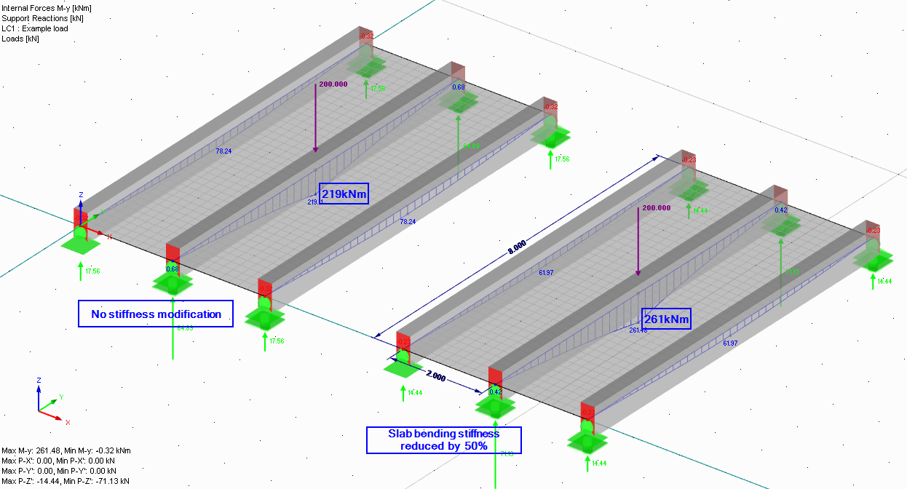

# The (non)ideal world

## Time vs. Quality vs. Cost

The choice between **Time \<\> Quality \<\> Cost** applies everywhere.
Casting this idea on the design of buildings using FEA:

-   There is a limited time to create a model.
-   There are number of modelling/analysis limitations that most
    structural engineering software has. Or it may be that buying new
    software is not commercially justifiable;
-   Geometry - the real structure will be built imperfectly, there will
    be deviations from the designed geometry.
-   Material properties may be dependent on weather and construction
    methods that you may not know when doing the design.
-   In most of cases there won't be an opportunity to test a prototype to
    fine-tune the assumed behaviour of the structure.\
    (a major difference from many other engineering disciplines)

The good news is that there are widely accepted **simplifications** to
the model of the structure. An agreed way to work around the
limitations. Some of these are "agreed" in building codes, but many of
these depend on the engineer's judgement and/or interpretation of codes.

The main simplifications are related to:

-   Material behaviour;
-   Stiffness of connections and supports;
-   Discounting members that do not contribute to load path;

## Simplifications of material behaviour

None of the construction materials is **linear isotropic elastic**.

However, for the majority of calculations, we **assume** that steel,
timber, reinforced concrete, aluminium and glass behave as linear
isotropic elastic materials.

This lets us:

-   Simplicity = Speed. Speed up the modelling process and analysis;
-   Sum results from multiple load cases together to estimate behaviour
    under load combination;
-   Use approaches of design proven/tested on many other buildings --
    omit prototype design if we are operating within the "boundaries"
    that are covered by building codes.
-   Improve the quality assurance (read: checking) process of our
    models.

In Eurocodes it is explicitly stated that you can use linear elastic
analysis for the design of concrete, timber and steel:


 
 **5.4 Linear elastic analysis** \
 (1) Linear analysis of element based on the theory of elasticity may be used for both the serviceabiliy and ultimate limit states.\
 (2) For the determination of the action effects, linear analysis may be carried out assuming:
 - uncracked cross sections,
 - linear stress-strain relationships and
 - mean value of the modulus of elasticity


 
 **5.4 Methods of analysis considering material non-linearities** \
 (1) The internal forces and moments may be determined using either:
 - elastic global analysis
 - plastic global analysis.

 [My note:] For finite element models analysis the reference is made to EN 1993-1-5 which contains Annex C with more detailed information, but also allows use of elastic analysis.

 (2) Elastic global analysis may be used in all cases

 
 **5.1 Basis of Structural Analysis - Generalt** \
 (2) The global structural behavior should be assessed by calculating the action effects with a linear material model (elastic behaviour).



It should be noted that non-linear behaviour is often considered during
design checks according to code. i.e. forces from linear elastic FE
analysis are used and non-linear or orthotropic behaviour of material is
considered when checking stresses in members or buckling capacity.

There are several cases where you would want to depart from these
assumptions. For example:

-   Calculating exact deflections for concrete structure;
-   Efficient design of steel connections and portal frames;

## Steel structures

-   By its nature steel is isotropic -- plastic material;
-   Until steel stresses reach yield strength -- the material is linear, isotropic, and elastic;
-   After reaching yield strength, the stresses will re-distribute due
    to plastic behaviour.

Design codes allow the use of the plastic behaviour of steel, in fact,
it is the described way for checking the capacity of beams in bending in
Eurocodes.

**Key points to keep in mind when modelling steel structures using FEA tools:**

-   Linear elastic = safe, conservative design.\
    If you don't let the steel to reach yield stress in your model, your
    design will still be safe.
-   1D elements = Beams/Columns
    -   Sticking to elastic material for 1D element modelling is a
        long-proven practice.
    -   It is preferred to consider plastic behaviour during the element
        design stage
-   2D elements = surfaces. In most cases, surfaces will be used for
    modelling details/connections. Using linear elastic material, you
    will often notice high-stress peaks. Most often in:
    -   Locations of nodal supports or bolts;
    -   Location of sharp corners;

**Ways of dealing with stress peaks:**

-   Doing additional modelling work - representing supports with their
    actual area, adding rigid links to represent thickness etc.
-   Using isotropic-plastic material and running non-linear analysis;
-   Changing the actual geometry of the structure - e.g. considering
    rounding corners.
-   Exercising engineering judgement on how the plastic behaviour will 
    affect linear analysis results. I do not suggest doing this if you
    are just starting to do structural design. But the more design you
    will do, the more confident you will become.

## Reinforced Concrete Structures

Reinfoced concrete is the most un-linear un-elastic un-isotropic material of all
practically used construction materials:
-   RC is **composite** -- reinforcement steel typically taking the tension
    and concrete taking compression;
-   Concrete is **non-linear** -- creep and shrinkage lead to concrete
    deformation without stress increase in section.
-   RC elements are likely to be **orthotropic** -- depending on the
    direction of reinforcement, there will be enhanced tensile capacity
    in one/two or all three directions.
-   RC elements are **plastic** -- after the concrete is cracked, it stays
    cracked.

Yet, the design of elements using linear elastic analysis is the most
popular way of calculating internal forces in members.

-   **Composite** action is accounted for when designing elements
    (beams/columns etc.) to code;
-   **Cracking and creep** are either:
    -   Neglected for some simple calculations, considering that the effect
        on internal forces distribution may be small;
    -   Accounted by stiffness reduction factors applied to bending/axial
        stiffness;
    -   Considered implicitly and non-linear calculation is done;
-   The **orthotropic** nature of reinforced concrete is neglected at the
    static analysis stage -- the reinforcement is added only in planes
    where it is necessary.\
     However, choosing the rotation of local axis for 2D elements will be important for desing of slabs.

**Key points to keep in mind when modelling RC structures using FEA** 

It is a **"game of stiffness"** between beams/columns/slabs:

-   In-situ concrete frames will be statically indeterminate structures,
    with moment transferred through connections; Forces in members are
    highly dependent on **relative stiffness** between elements.
-   By default, the software will model your elements using **uncracked**
    concrete stiffness. Appreciate that due to **cracking and creep**,
    almost any member will be less stiff than uncracked concrete.
-   Acknowledge that it is **impossible to model the exact stiffness** of
    elements. Creep will be time-dependent. Cracking is often governed
    by overload at the construction stage (and you may not know the
    construction programme at the time of the design). 
-   As soon as your building gets taller than \~10 storeys, the **axial
    shortening** of columns starts to play the role;

Play the "game" **safely**:

-   Consider **upper and lower bounds** for stiffness of elements and
    connections e.g.;
    -   If you intend to design the stability system it is safe to release
        rotations (add hinges) at column ends in the FE model;
    -   If you intend to design the columns, keep the rotations at column
        ends fixed.
-   Consider cracking and creep when **calculating deflections**.
-   Manual calcs allow for **"redistribution" of bending moments** --
    transfer of some part of hogging moments above the column to
    midspan. It won't be possible to do this using typical FE analysis, however:
    -   Always **stay safe with bottom reinforcement**. Be generous, if
        possible;
    -   And the other way around -- there is no need for design for that
        very peak value of the hogging moment.
-   It is a common practice to **design RC slabs using separate models** --
    thus, ignoring the effect of axial shortening on slab design.

## Timber structures 

Timber as a material is:

-   **Orthotropic**. Properties along the grain are significantly better
    than perpendicular to the grain.
-   **Non-linear**. Sustained loading causes creep -- with time the deflection increases
    without stress increase in elements.

The orthotropic nature in most cases is considered at the element
design check -- after static forces have been calculated by linear
elastic static analysis.

Similarly, creep is considered for deflections by applying factors
to sustained loading. (If you are using Eurovodes, see section 2.2.3 of EN 1995-1-1)

However, the main thing to remember when modelling and designing
timber structures is: **Connections govern the design capacity**. Often, connections also
govern the member sizes.

Many of programs have embedded code-checking modules that will allow
you to run analysis, obtain internal forces, run
bending/shear/compression/deflection checks according to code, and
give you a confident utilisation under 100%\... 
And if **at least preliminary design of connections** have not been done when choosing element sizes -- there may be unpleasant surprises.

## Simplifications for connections

I do remember when I first started modelling structures. One of my first
questions was -- **where should I add hinges** = where should the rotations
at member ends be released?

Yes, in the "ideal world" each connection has stiffness. But in most
cases, you can model the connection as either fixed=continuous, or
pinned=not restraining any rotation.

The **very simplified recipe** would be:

-   Release all the steel connections but do account for eccentricities
    (e.g. using rigid links) at column/beam connections.
-   Treat precast concrete connections similarly to steel ones -- but do
    model eccentricities that are caused by corbels. Keep
    column-to-column connections fixed.
-   Keep in-situ concrete elements with fixed ends.
-   Release all the timber connections and timber-to-steel connections.
    Unless you are intending to specifically design a moment frame.

Many engineers at this point will shout: "**Not true!** steel structures
have plenty of moment connections!" Well.. true.. but one must start
somewhere. There are typical pinned and moment connections shown in the [Steel section of notes](/docs/steel)

The **area where you must be very careful** regarding connections --
pinned or sliding connections with a large force in one direction,
but a "free movement" is assumed in any other:

-   It is common to discount friction in calculations. However, you
    can't expect the beam support to have a **completely sliding support**
    if there are large vertical support reactions. (Teflon bearings are not cheap either)
-   For a steel connection with large axial force, many bolts and/or
    thick plates may be required. An assessment should be made as to
    whether you can still consider this **connection as pinned**.

## The stiffer load-path wins

In cases where there are multiple load paths, the **load will "choose" the
stiffer one**.

This statement can also be flipped the other way around. The considered
load path will be redundant if there is another load path that is
significantly stiffer.

Examples of this statement are:

-   **Tension bracing.** Traditional bracing in frame buildings (steel,
    precast concrete, timber). One of the braces will be in tension,
    another in compression. The tension one will be relatively stiff and
    carry all the force and ensure stability. The compression one will
    have a tiny capacity because of buckling effects. It will be
    redundant.

-   **Rigid links** (or "rigid members" or "coupling" in some software)
    ensure that the defined link is the stiffest element around and the
    load gets directly transferred to the linked node.\
    
    Two most popular ways of using rigid links:
    -   To represent parts of the **structure you want to avoid modelling** but
        will deal by some other means. A popular example is modelling
        eccentricities at connections.
    -   To use a single node to represent a support that is actually an area
        support:
        -   Representing **bolts or support areas** when modelling 2D surfaces -- by
            using rigid links you can avoid huge stress peaks appearing in
            results;
        -   Representing **support of core walls** -- thus calculating an axial force
            and moments for the core wall overall, rather than dealing with
            multiple linear supports.

-   **In-situ concrete structures.** Cracking can significantly reduce
    stiffness. The smaller and heavier loaded elements will crack more than larger and lightly loaded. This will "attract" more loads towards lightly loaded elements.

    An example below is a ribbed deck with a concentrated load on top of one
    of the beams.
    -   The first linear calculation shows that about 35% of the load is
        transferred to adjacent beams, max bending moment in middle beam = 219kNm.
    -   However, note that the thin slab in the transverse direction is
        likely to be cracked.
    -   If the slab has lost roughly half of the stiffness because of
        cracking, then it only transfers 28% to adjacent beams and the bending moment 261kNm in the beam under the load is **20% more**!
    -   ..and yes, the beam will also have some reduction of stiffness due
        to cracking.. but do remember to play the "stiffness game" safely!
        Note that before the widespread use of FE calculations, it is likely
        that the beam under the load would have been designed to carry the
        entire load (the approach I support myself, see [Concrete design section]("/docs/concrete/")) and the beam would have been designed for 400kNm bending moment.

    {{
}}

{{
}}