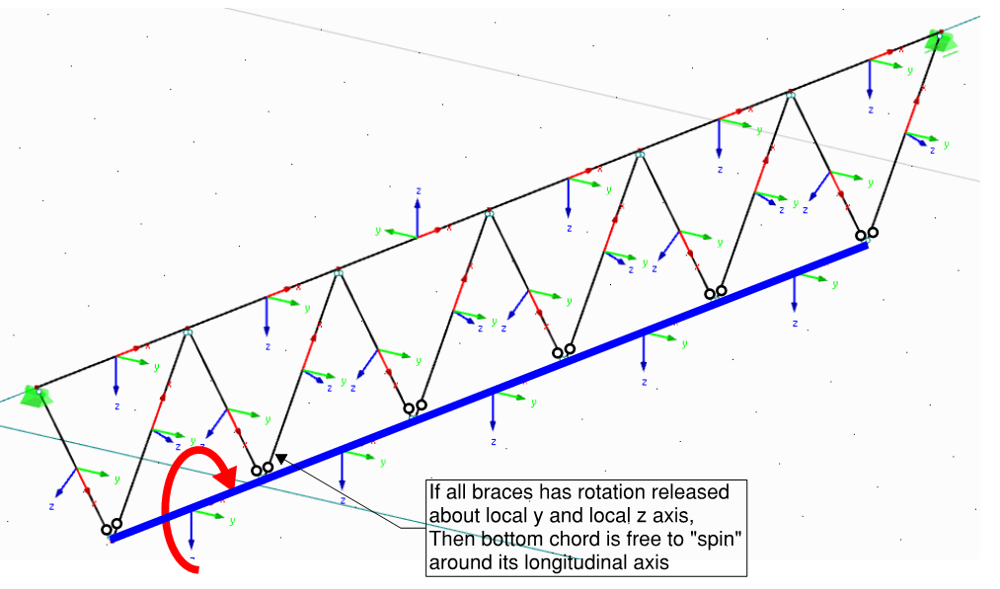

# Dealing with instabilities

Now, when the meshing is done and calculation starts to run.. great! You
just run the calculations and find out that.. model is unstable! This is a
normal step of **"debugging" your model**.

I am intentionally devoting a separate section to this because you will
spend a lot of time dealing with this - and **there is no easy way out**. 
Or actually there is - after hours spend fixing your models, you will gradually fix most of the problems during modelling stage.

If you see where the instability is happening, and the reason is
understandable -- good! However, often it is completely unclear why/what
is happening - The location of instability does not make sense;

**"Save As" your model first** -- experience shows that you may frequently
want to return to this broken model and re-start applying changes.

**Some strategies/checks for dealing with instabilities:**

1)  Are there are multiple **self-sufficient models** (i.e. independently stable and disconnected) in one file, separate them!

2)  It is likely that you will be running the calculation multiple times
    until you got things sorted out. Firstly, **make the model stable at
    dead load case**. You may switch off the calculation of other cases
    for quicker process. Or just re-run the deadload case if your
    program has option to run one case a time.

3)  If the cause is not obvious, before doing anything else, try
    **switching off non-linear "features"** of your model.
    -  Is it actually instability or could it be that model just
        haven't converged within the maximum number of iterations set in
        software?
    -  Are you using tension bracing, can it be that this causes
        instability if there are no lateral loads and self weight puts both braces in compression?
    -  Are you using compression-only supports or contact surfaces? Can
        it be that these are being relied upon for stability?
    -  Are you using non-linear materials?

4)  Is the entire model stable respective to all **6 degrees of freedom**?
    -  Any supports missed?
    -  Maybe you need to fix the rotation entire structure around vertical (typically "Z")
        axis?
    -  Are you trying to model 2D structure in 3D space and forgot some
        of degrees of freedom? A good example is a truss bottom chord.
{{
}}

{{
}}

5)  Do nodes "node-out"? Are there two **geometry nodes very very close** to each
    other that are meant to be a single node? Are there two nodes at the
    same coordinates?
    -  You can switch on node numbers and see visually whether the
        numbers refer to the same place.
    - Try "regenerating" your model. As mentioned above, regeneration has some downsides. But at least you will be confident that the problem is with geometry, not the supports or hinges.
    -   You can alternatively export coordinates of all nodes to Excel, sort by X
        , Y , Z then compare coordinates of adjacent points -- if all
        three coordinates (or just one, or two) are differing just a
        tiny bit -- this is likely to be a problem location. Use
        "conditional formatting" to highlight nearby nodes.

6)  If it is a rotation causing instability, **remove hinges step-by-step**
    to see there exactly the instability is happening.
    -  The most common instability is to have both ends of the member
        torsionally released -- this will instantly show instability as
        the member can rotate around its longitudinal axis;
    -  What about pinned supports? A classic situation in Autodesk
        Robot is to used default "pinned" support and have all the
        columns rotating about longitudinal axis;
    -  Is the instability happening in location with multiple members
        connecting an all of these having hinges defined at the node?
        Try removing hinge for one of the members -- to ensure that node is
        not "free spinning" around itself.
    -  Some programs may also allow to put hinge at the end of "truss"
        member. If the member itself has no bending stiffness and a
        hinge is applied at end to release this stiffness -- this causes
        instability.

7)  Build your model from **discrete parts that are stable on their own**.
    If you have primary trusses and secondary trusses, make sure that
    each of elements are stable on its own and only then get them
    together in one model.\
    I especially encourage doing this if you are taking over work from
    someone else -- this is a good way to gain
    understanding about structural behaviour of structure.

8)  For steel/timber structures (with mostly "bar" elements) -- have a
    think whether the model can be simplified. E.g. do you need to model
    **full truss for design of stability bracing**? Maybe just a member
    representing the stiffness of truss is enough?