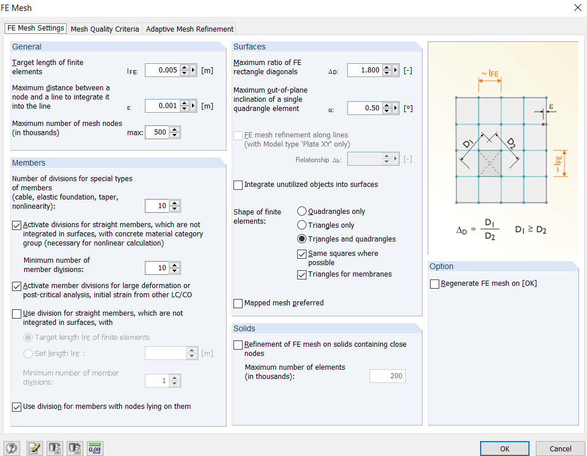
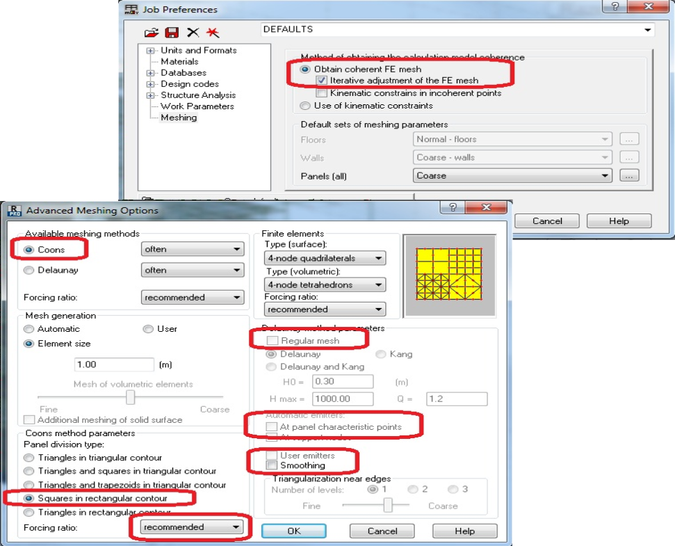
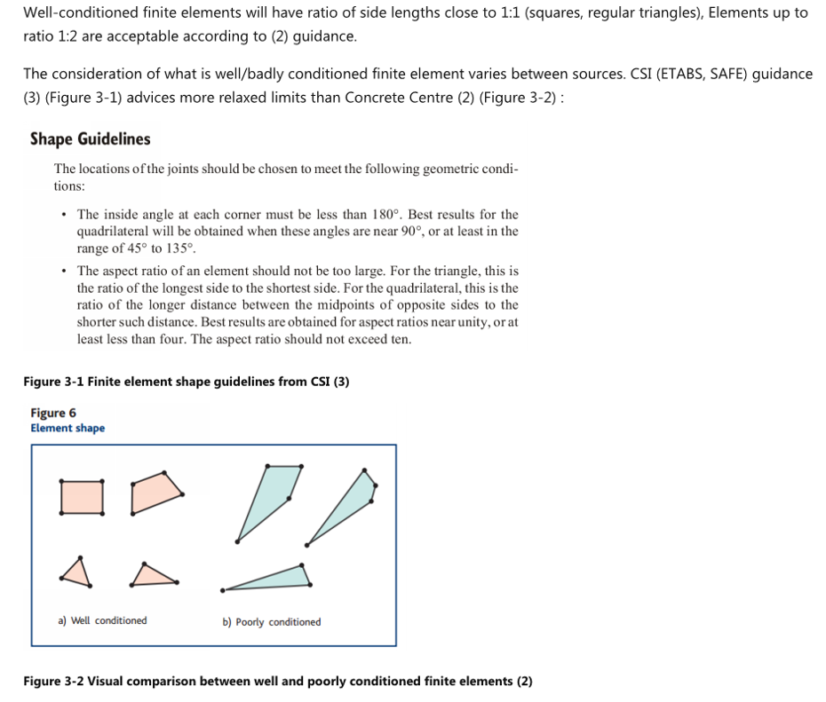

# Meshing

## Mesh settings and quality of mesh

When the geometry and loads are defined, the next step is meshing --
creating actual FE elements and nodes from elements and surfaces.

This entire section assumes that you will be using a meshing engine provided 
in FEA software. There are cases when mesh is created manually, but 
if you feel comfortable to do that, then you might already know everything
mentioned in these notes.

Again, this section might be worth another course/book. However, in my
experience, a good automesh engine will do most of the work for you, if
you prepare model well and choose a sensible element size.

The finite element model will be created, based on geometry nodes,
members and surfaces. The model will consist of much more nodes that the
ones defining geometry.

There are **no "hard" rules** for mesh settings. I did start calculations
some 10 years ago by following the rules advised in [How to design reinfroced concrete flat slabs using
finite element analysis](https://www.concretecentre.com/Resources/Publications/How-to-design-reinforced-concrete-flat-slabs-using.aspx). \
Which basically says - choose size to be **1/10 of span
size**. And this has worked for me well so far.

Some programs may have options to define mesh divisions as number of
**divisions per surface**. I strongly suggest using absolute "target" size in
meters/feet -- this will help in generating coherent mesh at joints of
surfaces.

The settings I suggest paying attention:

-   **Mesh size for surfaces** Have a look at your smaller span. Take 1/10 of this
    distance as a starting point. Note that there are cases where more
    refined mesh will be required, for example exact calculations of
    long term deflections in floor slabs. [See concrete design section](/docs/concrete/).

-   Settings for **linear members**. Again - choose at least 10 divisions if
    you can set this setting;\
    Although, I have never experienced problems for 1D or "bar" elements
    in static analysis, this is very important for critical **buckling
    load calculation**. 

-   **Element shapes** -- use of both Triangular and Quadrangular elements.
    Triangular elements will come in very handy around arcs/circles and
    in transition of mesh sizes;

-   Although **solids** are outside of scope of this document, remember that
    the "depth" of member should be adequately meshed when using solid
    elements. For example. For solid representing beam in bending, you
    should be **dividing member depth** in about 10 divisions.

Below are settings that are a good starting point for Autodesk Robot
and Dlubal RFEM. Of course, adjust element size according to yor geometry.





Image from Autodesk support article ([source](https://www.autodesk.com/support/technical/article/caas/sfdcarticles/sfdcarticles/Object-meshing-error-recommended-meshing-options-for-panels.html))



### Quality of mesh

The very short advice is - elements with equal sides are the best.
I have very little to add to this topic myself, therefore I rather give you some good references:


Image from [How to design reinfroced concrete flat slabs using
finite element analysis](https://www.concretecentre.com/Resources/Publications/How-to-design-reinforced-concrete-flat-slabs-using.aspx))



- <https://www.engmorph.com/mesh-quality-parameters>

## Automesh challenges

Using modern programs, the biggest challenge is to prepare the model for
auto mesh engine. Garbage in => garbage out. Most of this section
focuses on RC buildings as these tend to be the difficult ones. However,
the general advice is applicable to all types of structures.

For software to be able to generate good mesh, following conditions
regarding geometry should be satisfied:

-   The edges of connected surfaces must be **aligned within tolerance** set in meshing engine settings;
    -   Overlap is bad;
    -   Not touching is also bad.
-   Unless you use some special features, all surfaces should be **planar**.
-   The nodes that are to be embedded in mesh of surface, should be **on
    the plane of surface**;
-   The lines that are to be embedded in mesh of surface, should be on
    the plane of surface;
-   Mesh size along **arcs and circles** should be small enough to avoid
    heavily distorted elements;
-   Automesh should be able to deal with **openings and small "steps"** in
    edges of surfaces without generating heavily distorted finite
    elements.
-   Although this is might not cause an error, be cautious of
    **overlapping members** that eventually increase the stiffness.

To satisfy these conditions, you should understand, **how is geometry
of surface defined**:
-   In Autodesk Robot, the surface is defined by "characteristic points"
    of contours that are not "attached" to any geometry nodes or lines.
    Of course, when defining these points, it is possible to snap
    nodes/members;
-   In Dlubal RFEM the surface is defined by lines, that can either have
    members or just be "null" lines without any stiffness;

Then understand the tools that can be used to adjust geometry and
mesh refinements:
-   Align tools
-   How can you snap lines to plane or gridline?;
-   General "Regenerate model";
-   Can you move any of auto-generated mesh nodes manually?
    -   You can do this in Autodesk Robot, but can not in Dlubal RFEM.
-   Mesh refinements.
    -   Around nodes;
    -   More fine/coarse mesh for entire surface;

Before you mesh, do a general simplification of model.
-   There is no need to model **small overhangs** of slab;
-   No need to model **openings** with size smaller than 300mm unless you feel that
    they may change the transfer of moment into columns;
-   **Split walls** at each floor. This creates nice edges at each floor
    level for surfaces to have a clean joint.;
-   **Arched edges**. It is preferred that these are simplified to lengths
    that are comparable to length of finite elements.
    - I spent a couple of years working on a building
    designed by Frank Gehry (read -- a lot of splines/arches) and I
    never did simplification of the the slab edge. This resulted in heavier model and
    distorted FE elements along the edge. If I had to do the design
    again, I would try to simplify geometry using parametric tools (such as [Grasshopper](https://en.wikipedia.org/wiki/Grasshopper_3D) ).

-   As mentioned in the [Geometry section](/docs/modelgeometry/) -- small strips (especially with width:breadth 1:4 or less) are easier to model as members.

Then mesh the model for first time and see locations **where a lot of
nodes are placed very close** to each other (likely to be a geometry
discrepancy). Also, look for program warnings (e.g. "kinematic
restraints" in Autodek Robot).

When adjusting geometry, please look at **full precision of nodes**, [See geometry section](/docs/modelgeometry/).

I generally suggest tackling meshing issues starting with as local
updates as possible:

1) **Geometry node** adjustments. See whether the adjustment of geometry
    points in problem locations will be enough. Maybe there is an extra
    node that is not needed?

2)  **Manual FE nodes** adjustments. Can you adjust the mesh in specific
    location manually to correct the error? This will be efficient if
    there is one or two such problem locations. This may not be possible
    in all programs.

3) Surface **adjustment to plane**:
    -   Can you snap the points of adjacent surfaces to the same
        vertical/horizontal plane. For Autodesk Robot there is a special
        "detailed correct" command. For Dlubal RFEM you can select multiple nodes
        and edit their coordinates all at once.
    -   Check whether the surface itself is not **warped** -- i.e. that all
        definition points lie on the same plane.

4) **Regeneration** of entire model:
    -   Be very careful with this as it may create new problems by uniting
        the nearby nodes into one. For example, if you have one node
        slightly above the slab level and another defining slab at slab
        level, it may be that both nodes are replaced with one in the middle
        -- thus making the slab to no longer be planar;
    -   Note that numbering of Nodes and elements will likely be
        changed, and this may have an effect if you import loads or export
        support reactions.
    -   In addition to model generation, you might also try to round the
        node coordinates to, say 1mm. Again, do this more as a last resort
        because this may cause new issues and will not solve issues that are
        larger than threshold of rounding. This may also prove to be a
        time-consuming process (for import/export of node coordinates).

As much as I would like to give a universal advice there, a lot at
meshing stage is dependent on **capabilities and specifics of software**.

For Autodesk Robot, I suggest that you watch the seminars below to
understand the parameters influencing the mesh and corrections
available:\
<https://www.youtube.com/watch?v=xYMxOfl7N1c>\
<https://www.youtube.com/watch?v=YpgOJtzjK7E>

For Dlubal RFEM the downside is that you have no chance of manual
adjustment of mesh after it has been generated. So, it all depends on
auto-mesh parameters being carefully selected. Saying that, I strongly suggest using Dlubal
RFEM specifically for models with a lot of surfaces i.e. RC buildings or
Steel connection design.