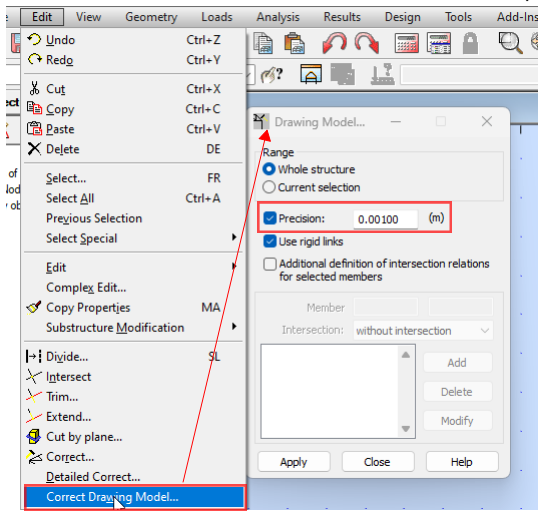

# Modelling Geometry

There are three sections about modelling - geometry, supports and loads. In these sections I am covering main "toolset" to create a finite element model. 

## Nodes

### Geometry nodes vs. FE nodes

There are actually two types of nodes. In this section I talk about
nodes that define the geometry.\
The finite element mesh will create more nodes -- both the line members
and surfaces will have intermediate nodes defining finite elements.


  **Geometry nodes**

  
  **FE nodes**



### Parameters

It is as simple as it sounds:

-   X, Y, Z coordinates.
-   Restraints = supports.\
    Almost all programs allow you do define a "support type" which then
    can be applied to multiple nodes.
-   Some programs allow you to use different coordinate systems. Either
    Cartesian (XYZ) vs. Polar (distance and angles).

### Commentary

#### Precision matters

If you have just a rectangular/orthogonal structure -- great! ..because
you might be one of the very few "lucky ones".

A lot of models need to represent inclinations, weird angles caused by
existing building site restraints or architectural intent. And other
features that lead to "exact" coordinates that can't be rounded. The
**"exact coordinates"** would be indefinitely long string of numbers after
the comma (or "non-terminating decimals"). However, we need the coordinates to be finite. And programming limits and numeric types used in programming means that every single coordinate is rounded at some precision.

Keep in mind that the coordinates that software display may be rounded
just to display those and actually may have more numbers after the
decimal point.

-   To check this with Autodesk Robot, go to ... "units" and set more decimal
    places;
-   To check this with Dlubal RFEM, go to "full precision".


**Dlubal RFEM:**\

**Autodesk Robot:**\



There are **two general approaches** to deal with rounding of
coordinates:

-   Doing it at modelling stage -- allowing, say, only 1mm increments of
    coordinates. Most frequently such updates are done when doing
    "regenerate model" (or similarly named) tool.


**Dlubal RFEM:**\

**Autodesk Robot:**\



-   Doing it at the meshing stage -- if the auto-mesh feature is used,
    usually software has certain "tolerance" setting which determines
    whether the nodes close to each other are "joined" into one node in
    finite element mesh.

For overall building models I personally would recommend for sticking to
precision of 1mm.

## Members

Surprisingly, members = 1D elements have the **most parameters**. This is
because a physical 3D solid is "squeezed" into 1D bar.

### Parameters

The minimum set of parameters every Civil/Structural FE software has:
-   start node;
-   end node (sometimes start/end node is replaced with "line");
-   cross section;
-   material (often cross section has material assigned);
-   rotation of the section along longitudinal axis (often called "beta
    angle");
-   rotational releases (hinges) at start/end of the member;
-   translational=movement releases at start/end of the member;

The further parameters are useful, but the implementation depends on the
program:
-   Stiffness modifiers. Preferably, software would allow separate
    modification for axial/bending/shear stiffness;
-   Option to make member as:
    -   Tension/compression only;
    -   Truss = tension & compression, but no bending
    -   Rigid = representing rigid coupling between nodes on the member;

### Commentary

#### Comments on geometry:

-   All modern programs allow to model in 3D. I strongly suggest to use
    3D model even for planar structures (such as trusses), because then
    you must explicitly state your assumptions about supports and releases.
-   Split of members, sets of members. If you will be using design tools
    integrated in software it is likely that the split of members will
    matter. Try to avoid extra nodes in the middle of the members that physically  and for design purposes will be continuous.
-   Local axis -- keep consistent along the length of continuous members and preferably use same rotation for columns as well.

#### Other comments:

-   **Rotational releases**. The likely scenario where you would need to use
    a rotational spring, is to use the exact stiffness of steel or
    timber connection, calculated in a separate model. However, in most
    of cases the rotations/translations will be either free or fixed.

-   **Translational releases** -- bearing supports. I would strongly advise
    to be consistent in use of supports and member end releases. I
    personally use support properties (i.e. remove restraint one
    direction), rather than properties of releases.
    -   Most frequently use for axial releases might be connections with
        long slotted holes. For example slotted holes on top of columns
        supporting façade.

-   Be careful with releasing rotation if there are **large axial forces**.
    Connection may turn out with many bolts, large/stiff plates that
    eventually add significant rotational stiffness.

-   **Tension/Compression** only members (no bending stiffness):
    -   Tension only members are usually used for steel tension bracing or
        representing stability diaphragms. Generally -- tension-only FE
        members usually represent members/surfaces with little or no
        buckling resistance.
    -   Compression only members are usually used in cases where connections
        at ends are not able to take tension, for example timber bracing.

-   **Rigid links** and use cases for those:
    -   Dealing with high stress peaks:
        - Intersections of member and surface. For example RC beam continuously anchored in RC wall;
        - Modelling areas of Bolt holes;
    -   Modelling eccentricities:
        - Eccentricities at beam/column interface
        - Sizes of sections. Truss eccentricities -- from Eurocode.


**Modelling eccentricities in truss**\

**Modelling bolt holes in steel details**\

**Modelling column section sizes flat slabs**\



-   **Stiffness modifiers**:
    -   These are most widely used to model cracking/creep effects in
        concrete. See [Concrete material section](/docs/concrete/).
    -   Be careful and write down how and where you apply those. There may
        be multiple ways how to apply those:
        -   Some engineers might use materials with adjusted E and G;
        -   Some engineers apply modifiers to cross-sections -- I personally
            prefer this;
        -   Some engineers apply modifiers to members individually;
    -   Check that they are considered in calculations -- do your test runs
        and compare internal forces between structure with stiffness
        modifiers and without.





## Surfaces

### Parameters

Basic parameters that most of civil/structural engineering software has:
-   Geometry -- lines or nodes defining perimeter;
-   Material;
-   Thickness;
-   Stiffness type:
    -   Normal;
    -   Orthotropic (think of a corrugated sheet or hollow core precast
        plank);
    -   Membrane (no bending);
-   Geometry of openings;

Additional parameters that might not be available in all software:
-   FE auto-meshing settings specific to surface (.e.g different mesh size);
-   Hinges -- linear releases along the edges;
-   Stiffness modifiers;

### Do you need to model surfaces?

When I think "surfaces", I usually think concrete slabs/planks, plates
in steel details and glass panes. It **might be that you don't even need to model** surfaces with stiffness:
-   If main purpose is to **distribute loads** on members -- there are tools in software
    for that:
    -   For Dlubal RFEM -- "Generation of area loads";
    -   Autodesk Robot -- "Cladding members";
-   If main purpose is to model **diaphragm** - what is the minimum you can
    do? Coarse mesh? Can you do rigid links only? Can you replace this
    with fictitious bracing?
-   For the design purposes, almost always the "bar" 1D members will be
    more convenient to design. Therefore, I suggest replacing **narrow
    strips** of RC slabs/walls with members and designing these as
    members. For columns/walls, Eurocodes considers "column" a member
    with width/length ratio 1:4 or less.

### Commentary:

#### Geometry

-   Understand what **defines the geometry** of surface-- lines, nodes or
    coordinates.
    -   Surfaces in Autodesk Robot are defined by coordinates of contour.
    -   Surfaces in RFEM are defined by lines (and lines are then defined by nodes).
    -   Surfaces in SAP2000 are defined by perimeter nodes.

-   **Connection with members** -- for most software, the members that are placed
    on surface plane and intersect it, will be embedded and fixed to
    surfaces during auto-meshing stage.
-   **Orientation of surfaces.** If you are doing RC design -- follow where
    top/bottom is (direction of z axis or axis "3" in some software).
-   Consider **centreline of thickness**. For example, if you model
    100x100x10 hollow section, actually you would be modelling 90x90x10.
    And it can actually matter as it would have significant effect on
    stiffness and section modulus that the section has..





#### Material

-   Choose properties according to building code. In Eurocodes this
    would be section 3 at every code (timber, steel , concrete,
    aluminium).
-   See whether there are extra "information" embedded in properties on
    material you choose. For example -- "cracked concrete" with already
    reduced properties.
-   Linear or non-linear. I urge you to start any model with all
    materials being linear and understand the basic behaviour of model first.

#### Thickness

Think, what does the thickness represent? What are you trying to
design?

-   **Composite slabs** -- should you model top only? Or do you want the
    correct weight -- meaning "average" thickness?.
-   If you decide to model tension-only **stability diaphragm** with plate
    that can take compression/tension, it would be reasonable to assume
    just half of the stiffness -- similarly as modelling tension braces.
-   **RC Slab overlaps** -- if you want to represent the weight, but not
    added stiffness (because of the way it might be detailed), thus
    keeping the thickness of one of overlapped slabs but adding extra
    self weight as load.

#### Hinges

There can be linear releases defined on the edges of the surfaces.

- Be careful modelling steel details -- **welded joints** will not behave like
    hinges.
- Hinge may also represent an assumption regarding the **load path in
    reinforced concrete**.
    -   Precast panels transferring bending one-way only;
    -   Slab not transferring any moment to core;
    -   Thermal breaks adding additional deflection to concrete slabs;

#### Openings

If you use auto-mesh, adding openings means additional complexity to meshing algorithm.

Think what you want to achieve with the model?
- In overall models for stability and vertical elements' design, the modelling of small MEP openings is an **over-complication** -- model just the big
risers, small ones are likely to change often and influence design nominally. 
- In slab models, I would not try to model openings smaller than 300x300mm.
- For steel connection models, I suggest using openings at **locations of bolts**
-- and model bolt via rigid links. See [Steel material section](/docs/steel/).

## Export from BIM software

Import/Export of models from BIM software like **Autodesk Revit or Tekla
Structures** is a huge topic, but I'll try to cover basics based on
my experience exporting from Revit.

Don't expect to the export to go like in some advertisement videos: **two
clicks and model ready**. It doesn't work like that. It is often still (at
year 2020) an "open question" whether the FE model geometry should be
generated from BIM model or build from the scratch.

Things to think about when exporting from Revit:
-   Do you have **analytical 3D view** set up in Revit, can you see and
    explore the analytical model only?
-   Are all elements you need defined as "structural", do they have
    **analytical lines/boundaries**?
-   Previously I described rounding in FE software. Similarly, there is
    rounding= **"tolerance"** settings in Revit. This will allow you to snap
    column ends to nearby levels.
-   Make analytical slabs or beams to "project" to **Revit "levels"** --
    this will ensure that floors are at the correct elevation.
-   Pay attention to slab **edges that are supported on walls**. For example
    -- slabs around core walls. This is a common location where slab
    boundaries go wrong.
-   A good practice for Revit modelling to ensure correct analytical
    model is to **split walls and columns** at every intersection with slab.
-   When the export is done, pay attention to rotation of sections. I
    have had multiple occurrences with incorrect rotation being exported, a
    software bug.

You might be interested to look into solutions that are based on "object
models" - idea that there is a **one "object model"** that is program
independent and data can be exchanged between multiple BIM and analysis tools:
-   <https://bhom.xyz/>
-   <https://geometrygym.wordpress.com/>
-   <https://docs.hypar.io/>