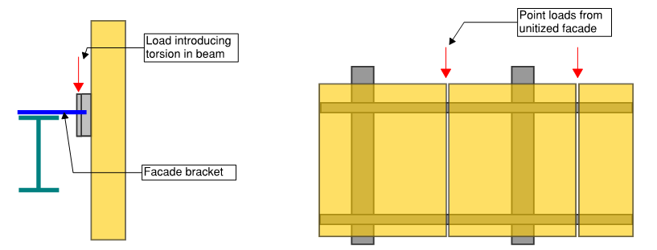
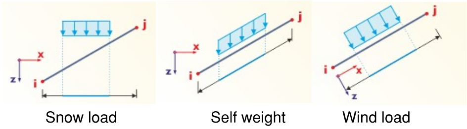

# Loads and combinations

## Load types

The toolset you are most likely to have, is:
-   Imposed **forces**:
    -   Nodal loads
        -   Member loads
        -   Uniform load;
        -   Linearly variable load;
        -   Nodal load on member.
    -   Surface loads:
        -   Uniform load;
        -   Linearly variable load;
-   Imposed **displacements** -- typically used to represent temperature or
    shrinkage effects;
    -   On Members;
    -   On surfaces;

For each of load types there will be few **main parameters**:
-   Magnitude
-   Direction of load;
-   Local/Global/Custom axis

And then there will be loads that are **generated by software**:
-   Area loads simplified as loads on members:
    -   Distribution one-way;
    -   Distribution two-ways;
-   Imperfections or Equal horizontal forces (EHF),
-   In some software, the generated wind/snow may be defined completely
    separately from other load cases.

Note on **nodal load** application. If you apply a nodal load to surface
element, it will inevitably cause a **stress peak**. If this is overall
building model and your mesh is quite coarse -- nothing to worry about.
However, if this is some local model, then it
is sensible to apply this nodal load as UDL on area as defined in code. An extreme example of this is design of **glass panes** where you MUST consider the area of point load to do a reasonable design.

## Load cases

**The commentary in this section assumes you are creating an overall model of building.**

Generally, I advise to keep as little number of load cases as possible.
However, do separate loads that are applied at different times -- i.e.
consider basic construction sequence. .e.g. use separate cases for
DL/SDL/Facade

### Dead load / Self-weight
-   Most programs allow you to change the direction of dead load. This may be relevant for assessing
    some parts of **structure during lifting/erection**.
-   For lightweight and lightly loaded Timber/Steel structures, I would generally advise to use
    factor 1.1 (i.e. 10% added) to account for weight of connections.

### Superimposed Dead Load

-   Typically, these are **finishes**;
-   Part that sometimes gets missed in overall building models -- weight
    of **stairs inside stability cores**.
-   My unpleasant experience is that the buildup of **finishes might change** even at late stage of the project. I suggest that you are generous with your SDL assumptions.

### Façade

-   A very common case if to add this as **linear load on slab edge**. This
    is completely appropriate for most of the cases.
-   I always suggest this keeping as a separate case, instead of adding
    to SDL -- results from this case may be very important for façade
    contractor (and I have been working for one such contractor).
-   Be careful if your building will have **"unitized" façade**.
    -   Firstly -- the load will be applied in **discrete points** -- and if the
        width of units are big enough, you might end up with worse situation
        because of point loads applied at mid-span.
    -   Secondly -- if the façade is "cantilevered" out, then there will be
        an additional moment on slab edge. If you have an in-situ concrete slab,
        don't worry. However, if you have steel edge beams -- note that there
        may add additional **torsion** imposed.





### Live loads

-   **Pattern loading.** Here is your chance to create a million load
    combinations! But please don't:
    -   In most of cases, considering 5x arrangements will be enough.
        -   One direction -- odd and even spans loaded;
        -   Other direction-- odd and even spans loaded;
        -   Checkerboard.
    -   The alternative to pattern loading is to assess single floor and
        after this assessment, apply a certain additional factor to live
        load. Again -- this is more efficient for concrete buildings because
        the live load is relatively smaller part of overall SLS/ULS load.
    -   Be clear on why you are modelling the pattern loading. Are you
        looking for a worst-case scenario for columns or for continuous
        beams/slabs?
-   Don't forget about **point loads** defined in code. This is
    unlikely to be important for overall building models or model with
    large spans. However, for local checks and small spans in public buildings -- these can
    and will be governing.
-   **Lightweight partitions** -- stud walls or glass walls. Whether these
    are "Live load" or "SDL" are disputable. There was a [good article
    about this in SCI journal](https://www.newsteelconstruction.com/wp/partitions-dead-or-alive/) and I personally agree that these should
    be added as live loads, because they can be moved during the design
    life of building and, thus, create pattern load effects. Note that
    [ASCE-7](https://www.asce.org/publications-and-news/asce-7) also has "partitions" under live loads section.

-   **Load reduction factors**. Eurocodes allows to reduce loads based on
    size of area that load is applied and the number of floors above
    (for columns). I strongly suggest these reductions to use only if
    absolutely needed to justify the design. It is extremely easy to get
    lost in these reductions -- where they will apply (and how they work
    together with pattern loading, if considered).

-   [Climate - Wind, snow, ice, sand, rain, flood load.]{.underline}

### Wind loads

-   These are acting **perpendicular to the surface** -- therefore handy to apply in local
    axis of member;
-   For overall building models -- almost every program will have some
    "generation" tool.
-   Always start with wind load in **4 directions**. However, remember the
    [famous case with CitiCorp building](https://en.wikipedia.org/wiki/Citicorp_Center_engineering_crisis) which could have collapsed
    because diagonal (quartering) winds were not considered.
-   Depending on building and construction code you are designing to,
    you may be required to assess "twisting" effects due to uneven wind
    pressure.

### Snow loads

-   In global vertical direction. 

-   Note that depending on location, **snow drifts** of even accidental snow
    load may govern.
-   Under the "snow" loads I also want to note that there will be regions in 
    the world where **rain or sand** loads will be relevant.


Images from software Dlubal RFEM



### Imperfection (EHF)

-   Technically, these are just a horizontal component of any vertical load;
-   Only to be considered at ULS (according to Eurocodes);
-   At least **4 directions** -- so theoretically for DL, SDL, Façade, LL --
    you are looking at 16 cases;
-   In my experience, it is **worth to combine** all DL+SDL+Façade+LL EHF
    into one case per each direction (i.e. total 4 cases). Usually the EHF will be a
    relatively small portion of horizontal loads (compared to wind) and
    therefore slightly conservative assumption of applying all at the
    same time will pay back in significantly reduced number of load
    combinations.
-   Also, even if your software is calculate EHF automatically, this is
    the right time to get your excel spreadsheet out and **calculate
    manual load takedown**. 
    - How does manual takedown compare to sums in
    model? 
    - How does automatically calculated EHF compares to vertical
    load sums in model?

### Robustness - avoiding disproportionate collapse

Robustness should be a key consideration when designing the
building. This is a large topic and I won't be discussing it
thoroughly in these notes. Two areas I want to highlight here:
-   It is likely that some of your building walls/columns will be **"key
    elements"**, meaning that they should resist 34kN/m2 accidental
    load (this is according to *EN 1991-1-7 section 3.3*, may differ in other codes).\
    Alternative is to assess a building without these elements --
    "taking out" column and wall and looking that the effect is on
    overall structure.
-   Connections should be able to take **tie forces** in accidental case.
    For Concrete this it usually easily satisfied using detailing.
    However, for steel, it may be that your connection design gets
    governed by robustness requirements, instead of forces from FE
    model.

### Other
I have very little experience with ground pressures or seismic loading and 
therefore these are not covered in my notes.

## Creating set of combinations

Do you know **what each load combination in your model
represents**? If not, then there are too many! I have seen
models with 300+ automatically generated load combinations with names
like "Gk + Qk1 + Qk3 + S".
A nightmare to check and understand what actually governs the design.

Questions to ask yourself:
-   Which are the **main groups** of variable actions, how many variations
    for each. E.g. "wind" would be one of the main groups.
-   Which of the variable loads may be **governing**?
-   Which of the variable loads have **small enough effects** that they can
    be considered to be "always acting" and taken without any reduction
    coefficients? This would reduce number of combinations.
-   Can any of the loads can be "beneficial" -- i.e. **reducing effects** in
    some part of the structure. E.g. can there be tension in some parts
    of stability system, if the dead load is applied with factor 1.0 or
    0.9 (depending on the building code)? If so, extra combinations are
    needed.
-   Are any of loads **"cancelling out"** each other -- i.e. working
    opposite directions on the same members?
-   Even if you are strictly designing to Eurocodes, it is worth to have
    a look at combinations mentioned in [ASCE-7](https://www.asce.org/publications-and-news/asce-7). This relatively small
    number of combinations, gives you a good overview of what needs to
    be considered.
-   I suggest that you mention the governing load in the combination name.

If you are designing according to Eurocodes -- think about the reliability class of your building. One of
the simplest ways to ensure reliability requirements for class 3
buildings (concert halls, grandstands etc.) is to multiply the
"standard" safety factors (1.35 for dead loads and 1.50 for live) by
1.1. See [EN 1990 Annex B](https://eurocodes.jrc.ec.europa.eu/EN-Eurocodes/eurocode-basis-structural-design) for further information.
    

## Load/result combinations

There are two different approaches for combining load cases:
-   Loads combinations = Combining loads from multiple cases and then doing
    calculation;
-   Result combinations = Doing calculations for each load case separately and then combining (summing) results of cases;

Usually there are more combinations than there are load cases. Therefore
summing the results and using **"result" combinations is usually faster** and it is very convenient
to determine envelope of internal forces.

However, "result" combinations are not usable, as soon as the calculation
is **non-linear**. In these cases, **you must use "load" combinations**:
-   Non-linear material used;
-   "P-delta" or "Large displacement" analysis used:
    -   Large lateral forces on vertical columns/walls;
    -   Tension/compression only elements used;
    -   Contact supports used;