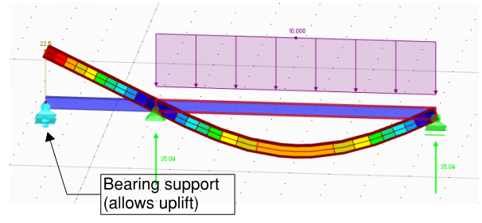

# Modelling Supports

Although from pure FE perspective the restraints are added to nodes, from practical standpoint there are three types of supports:
-   Nodal
-   Linear
-   Surface

### Parameters
Basic parameters:
-   Translational stiffness
-   Rotational stiffness
-   Rotation (i.e. direction of local axis)

Additional non-linearity parameters not available in all software:
- Varying stiffness based on applied force;
- Compression/tension only supports (e.g. vertical bearings);

### What do the supports represent?

-   Are you modelling a part of the structure and supports represent
    surrounding beams/slabs/columns?
-   Are you modelling foundations?

### Communication of forces

Often, the support reactions of your model (your output) is an input for
someone else. Try avoiding linear and surface supports if you need to
communicate loads to others.
-   Communication of finite number of **nodal support** reactions is fairly
    simple.
-   Communication of varying **linear support** load can prove to be pretty
    complex.

One of possible workarounds is the use of rigid links -- link the bottom nodes of walls
into one support per wall or core. Note that using of such rigid links implies that it is reasonable to assume linear distribution of forces along the walls. Typically, it would be, but there might be exceptions.

### Friction

In civil engineering it has become almost a standard approach to neglect
friction. In my opinion the two main parts are:

-   It is hard to know the exact coefficient of friction. It may also
    depend on the quality of works. [Approximate friction coefficients (Wikipedia)](https://en.wikipedia.org/wiki/Friction#Approximate_coefficients_of_friction);
-   Usually, ignoring friction is a conservative approach;

When modelling supports, be careful of releasing horizontal movement if
the vertical loads are large.

### Imposed displacement -- thermal/shrinkage

Add an imposed displacement -- thermal and/or shrinkage (for Concrete)
loads, then add supports with completely fixed translation (i.e. pinned
supports). And you are almost guaranteed to conclude that your structure
doesn't work.

-   Firstly note, that if your building is fairly typical, structure is not exposed to weather, and you have introduced movement joints, then
    it is completely acceptable **not to design for thermal loads**.


**Section 3 - Design situations** \
(1)P Thermal actions shall be determined for each relevant design situation identified 
in accordance with EN 1990. 
 
**NOTE: Structures not exposed to daily and seasonal climatic and operational temperature 
changes may not need to be considered for thermal actions.** 
 
(2)P The elements of loadbearing structures shall be checked to ensure that thermal 
movement will not cause overstressing of the structure, either by the provision of 
movement joints or by including the effects in the design. 


-   For steel buildings, note that part of thermal movements will be
    accommodated by oversized holes in connections (unless you use HSFG friction bolts).
-   Think about the thermal/shrinkage change at supports' level. Imposed
    deformation is always "relative". For example, it is likely that
    temperature change in basement will be somewhere in-between to the
    one in upper floors and one at foundation level.
-   I would insist that for thermal/shrinkage assessment of lower floors
    (or basement) , shear stiffness of foundations must be modelled --
    otherwise the horizontal loads on foundations may turn out to be
    unreasonably big.

### Modelling foundations

-   Think about the vertical level you put your supports on. Horizontal reactions in supports will likely cause additional moment on piles or bearing surface.
-   In most cases it will be enough to use supports without any spring
 stiffness. e.g. Eurocode suggests that a simplified supports can be used if the relative settlement between adjacent supports is L/500 or smaller.

    
(2) The maximum acceptable relative rotations for open framed structures, infilled frames and 
load bearing or continuous brick walls are unlikely to be the same but are likely to range from 
about 1/2000 to about 1/300, to prevent the occurrence of a serviceability limit state in the 
structure. A maximum relative rotation of 1/500 is acceptable for many structures. The relative 
rotation likely to cause an ultimate limit state is about 1/150.

(5) These guidelines concerning limiting settlements apply to normal, routine structures. They 
should not be applied to buildings or structures, which are out of the ordinary or for which the 
loading intensity is markedly non-uniform.
    

    
    
2.3.1.3 Differential settlements/movements 

(2)  The effects of differential settlements should generally be taken into account for the 
verification for serviceability limit states. 
    
(3)  For ultimate limit states they should be considered only where they are significant (e.g. 
fatigue conditions, in the verification of stability where second order effects are of importance, 
etc). In other cases for ultimate limit states they need not be considered, provided that the 
ductility and rotation capacity of the elements are sufficient.  
    

    The way how I interpret the codes is that settlements within the
    Eurocode 1997-1-1 Annex H limits (L/500) Can be ignored for determination of ULS forces. However, the potential additional effects on the sway of the building should be considered.

-   Is your system statically indeterminate? If you design a "typical"
    steel building with bracing, then likely that foundation stiffness
    will be irrelevant even if the deflections are larger than L/500.
-   When modelling long foundations, in many cases it will be reasonable
    to simplify stress distribution of linear.
-   When modelling surface foundations, keep in mind that frequently the
    conservative **design for raft** (or concrete slab on the ground) results in less
    conservative design from **geotechnical** standpoint and vice versa. Discuss this with
    engineer who does the foundation design.\
    A typical conservative design of raft would be to distribute applied
    load as UDL on the entire raft area.

-   I would not suggest modelling entire floors on the ground -- instead
    I suggest using guidance in [TR34 Concrete industrial ground floors](https://www.concretebookshop.com/tr34-4th-edition---concrete-industrial-ground-floors-a-guide-to-design-and-construction---jan2018-4188-p.asp). It is a proven practice. There is even [Tekla Tedds](https://www.tekla.com/products/tekla-tedds) calculation spreadsheet
    for it.

### Non-linear supports

-   Nodal compression-only supports can be used if you have beam just **vertically bearing**
    on support and it is expected that there might be uplift at this
    beam end. 

    



-   Surface compression-only or "contact" supports can be very
    effectively used for design of **steel-to-concrete connections**. There is a good article on modelling "contact" in one of my favourite blogs [EnterFEA](https://enterfea.com/when-to-ignore-contact-in-fea/).

- Theoretically, non-linear nodal supports with variable stiffness could be used
to model more precise **behaviour of piles** -- however, I have not seen
such examples in my experience so far.