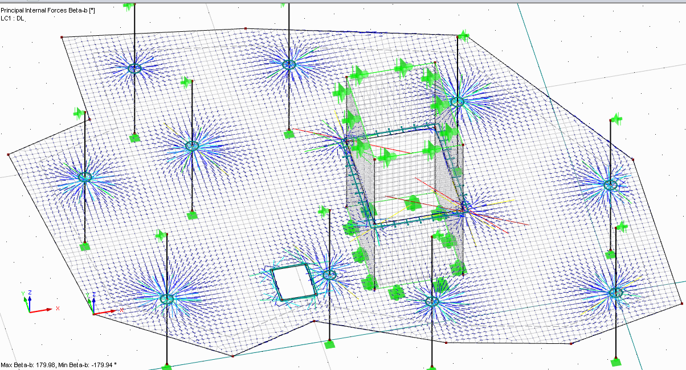
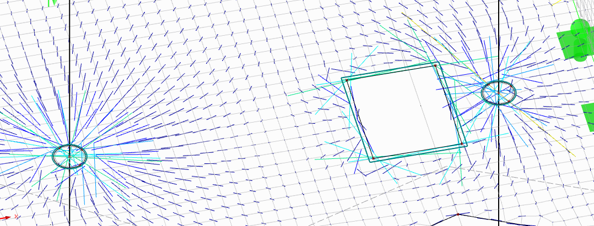
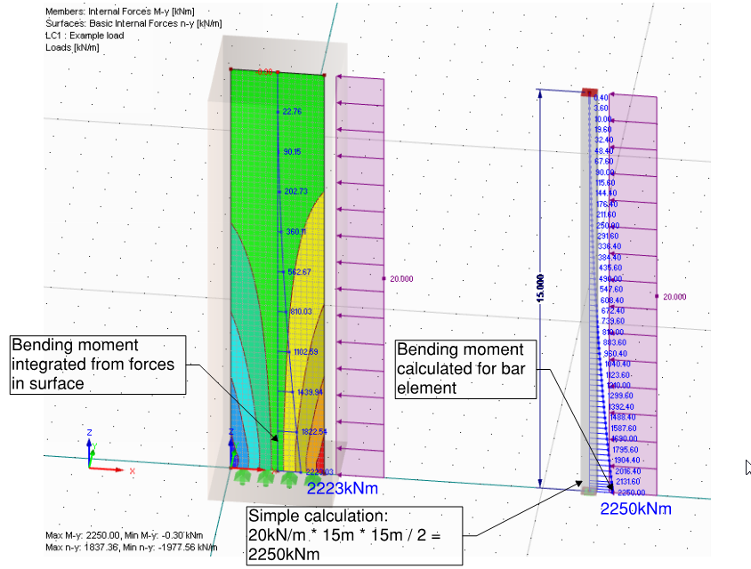
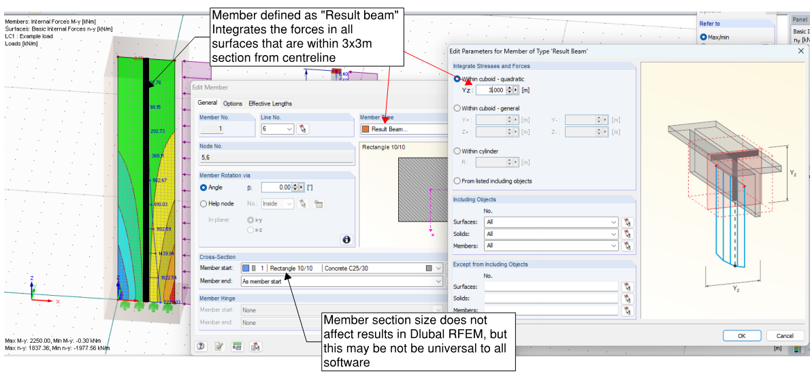

# Results

## Results verification

Calculation finished! You got the results! **But can you trust the results?**

The basic **widely suggested check** is to see whether sum of loads in the
model is the same as sum of calculated reactions. To be honest, within past 10 years
I have never seen a model where this is not satisfied. However, I have
seen lot of models where something has gone wrong. Such a primitive check
tells you very little about the model behaviour.

Steps I suggest for gaining confidence about model results:

1)  Start with **deflection checks at self-weight** cause. Does it deflect
    as expected? If not -- there is no point of doing any other checks.
    - Re-check boundary conditions if needed. 
    - Re-check hinges at bar ends.
    - Re-check whether there might be duplicate nodes.
    - Go back to ["Dealing with instabilities"](/docs/instabilities/) section;

2)  Then check **deflection for other load cases**. Have a look at maximum
    deflection. Also, look at rotations. Are there areas where
    displacements/rotations are significantly larger than elsewhere?
    What does cause those? Sometimes such locations arise when model is
    theoretically stable, but relies on member **torsional stiffness** -- something
    that you would rarely want to rely in a real structure;

3)  If there is a load case with relatively **uniform load applied** on
    horizontal members (e.g. SDL on floor), check whether the
    deflections are also relatively uniform (assuming the floor
    stiffness does not vary significantly).

4)  **Support reactions**:
    - Check if there are any **"torsion" bending moments** delivered to
        supports. Did you intend to have those?
    - Are there significant **reactions acting opposite each other**? i.e.
        is the sum of absolute values of reactions significantly different than
        sum of reactions considering signs of numbers? Sometimes there
        are unwanted moment frame effects.

5)  **Members**:
    -  Bending moment about main axis -- is there any location where
        **unwanted continuity effects** arise?
    -  **Torsion in members** -- in most steel/timber structures you would
        want the torsion to effectively be zero or close to zero.

6)  For overall building models, **manual load takedown** is always a good
    idea. The sum of reactions should correspond to loads calculated in
    manual load takedown.
    -  Remember that if you have continuous floors, then manual load
        takedown will be only useful to check sums of reactions.
    -  Another good check is to see sum of **Equivalent horizontal forces**
        and check whether they correspond to the set portion (e.g. 1/400)
        of sum of vertical loads?
    -  What about **wind loads**? Does sum of wind load reactions in
        particular direction is the same as manually calculated using
        pressure + suction?

7)  If your model has any **non-linear features**, check if these are
    working as expected:
    -  Check whether **tension bracing** gets engaged in the load cases
        with wind in respective directions;
    -  Check whether **compression only supports** allow movement when
        tension is introduced. For surface bearing supports check the
        stress at support. It may be that stress is unreasonably high,
        meaning that spring stiffness could be too stiff there.
    -  If non-linear material is used, check the **extent of area that
        acts non-linearly**. 

## Stresses in surfaces

The purpose of this section is not to reiterate about forces/stresses
available for every shell element. There are good references in documentation of software:
- [Dlubal RFEM](https://www.dlubal.com/en/downloads-and-information/documents/online-manuals/rfem-5/08/15)
- [Autodesk Robot](https://knowledge.autodesk.com/support/robot-structural-analysis-products/learn-explore/caas/CloudHelp/cloudhelp/2021/ENU/RSAPRO-UsersGuide/files/GUID-E73EA3A2-AEC8-40EA-8AC3-E7EDCA7644C2-htm.html)
- [SAP2000](https://wiki.csiamerica.com/display/kb/Shell)

My intention is to focus on points that are easy to miss or are
frequently used in design:

-   Note that in Autodesk Robot and Dlubal RFEM there is difference between notation of results axis for bar (1D) and shell (2d) elements.
    -   For bar (1D), **My** is moment *about* y axis.  
    -   For shell (2D), **my** is moment *in* y axis direction (about x axis)
-   When looking at stresses of surfaces, remember that there are at
    least **three layers** to view the results -- top layer, middle and
    bottom layer.\
    For example, Autodesk Robot "by default" shows stresses in middle
    layer -- stresses caused by bending won't be there.
-   For checking whether the behaviour of surface elements is as
    expected, additional to bending moments, a **direction of principal
    shear forces** can be viewed.
{{
}}

{{
}}
-   Remember that the static analysis results do not account for any
    **buckling effects**. If you see a considerable compression stress, it
    is up to you do judge whether buckling may be an issue within parts
    that are in compression.

**For design of concrete slabs or walls**, it is required to account for
**twisting moments and in-plane shear**. [Wood & Armer method](https://help.autodesk.com/view/RSAPRO/2015/ENU/?guid=GUID-80FE7814-C14D-4A89-A6DF-68EB9E7E4815) is the most
popular way to do it.\
If you wish to design reinforcement based on FE results, you must use
these "adjusted" internal forces. In Dlubal RFEM these are called "design
forces", in Autodesk Robot you can view these in "Maps \>\> Complex".\
The general idea is very simple -- the absolute value of "design force"
is sum of absolute value of n.x or n.y plus absolute value of shear
force n.xy. The same process/idea is applied to moments m.x and m.y
and twisting moment m.xy.

**For design of steel plates**, A simple approach is to use [Von Mises
equivalent stress](https://www.dlubal.com/en/downloads-and-information/documents/online-manuals/rfem-5/08/22) that accounts for normal and shear stress in all
directions. Compare this stress with yield stress. Note that Von Mises
stress criteria is also typically used (one of the options) for calculations with
non-linear material and assessing whether the stress are above yield
stress and material properties should be updated.

## Result beams/sections

In Dlubal RFEM these are called "result beams", in Autodesk Robot these are called "Panel cuts". 
In ETABS these are called "Piers" or "Spandrels". However, the idea of all these features are the
same -- to **integrate results of surfaces and output these as results of
linear beam**.

These are very helpful features for designing concrete walls
(theoretically, these work on any surface, including steel). They are
also very helpful to assessing buckling effects in surfaces via
equations in building codes -- because those equations are written for
assessment of columns, not continuous surfaces.

Result beams are also useful if you need to communicate forces that are
transferred via walls -- set of member forces are much easier to
communicate than varying linear loads.

{{
}}

{{
}}