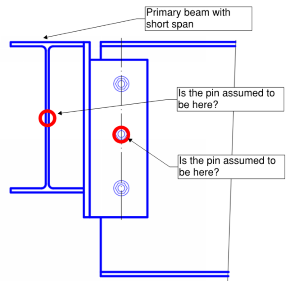

# Material -- steel

## Tension bracing

I want to start the steel section by showing options for modelling the
very basic part of steel structures -- tension bracing. There are
multiple ways do to it:

-   You can use tension-only members in software. However, remember that
    without lateral force, such structure will be unstable -- one of
    braces must be in tension.

-   You can manually "switch" off the compression braces, depending on
    the load case. Not all software has such features. You can also
    create a model that has some of the braces removed;

-   If the braces are the same size, you can model both braces, reduce
    axial stiffness by 0.5 and at the design stage manually account;

{{
}}

{{
}}

## Buckling

Design is easy while all the elements are in tension. just check the
stress.. and done! The actual challenge is assessment of buckling.

After I wrote this section, I realized that actually the content I have created is very similar, but less detailed that Lukasz Skotny has done on this blog EnterFEA.
Therefore, I rather provide you with links to the better explanation:
- General principles about buckling analysis: <https://enterfea.com/what-is-buckling-analysis/>;
- Example of a buckling calculation for column with a variable cross section: <https://enterfea.com/buckling-length-of-a-column-with-a-variable-cross-section/>
- Example of a lateral-torsional buckling calculation for a beam: <https://enterfea.com/how-to-calculate-critical-moment-with-numerical-analysis-in-rfem/>

The short summary from perspective of Eurocodes:

-   First determine Euler's critical buckling load. This is relatively easy to do using FE analysis. This approach is applicable to both column buckling checks and beam LTB
(lateral torsional buckling) checks.

-   Then reduce this "critical buckling load" to account for
    imperfections of member. Any column or beam is never completely
    straight and additional bending is imposed due to compression
    member. This can be done using Equations in Eurocodes.

## Steel connections -- modelling in overall model 

For every steel connection you want to understand two main
characteristics:

### Pinned or Fixed

Rotational stiffness (EN 1993-1-8 Clause 5.2) clasification:

-   **Nominally pinned**, does not transfer bending moments. Most of typical
    joints can be considered as such;

-   Rigid/**fixed**/continuous, ensures complete moment transfer;

-   **Semi-rigid** joints -- acts as rotational springs. I will not cover
    these in my notes. But the general approach would be to calculate joint detail, determine the rotational stiffness and then use this in the overall model.

Eurocode has an approach do classify every joint. You can do this by
stiffness or strength. A rigorous calculation approach is given in
section 6.3 of 1993-1-8.\
However, it is important to understand the types of joints that are
typically pinned and ones that are typically fixed. In my opinion,
you should be doing the rigorous calculation according to Eurocode
only in exceptional bespoke cases.

[Steel construction institute](https://steel-sci.com/) documents covers typical types of
connection and describes necessary checks for the joints themselves:

-   See [P358 "Simple joints to Eurocode 3"](https://www.steelconstruction.info/File:SCI_P358.pdf) for nominally pinned
    connections;
-   See [P398 "Moment-resisting joints to Eurocode 3"](https://www.steelconstruction.info/File:SCI_P398.pdf) for fixed connections;

If in doubt -- use pinned connection in overall model as this is
likely to produce more onerous internal forces and larger
deformations.

For trusses composed of hollow sections, you should (almost) always
treat connections as pinned, see Eurocode 1993-1-8 clause 5.1.5.

{{
}}

{{
}}

{{
}}

{{
}}

### Account for joint eccentricities

Use rigid links to account for eccentricities in joints.

For **"pinned" column/beam joints**, note that the design
of column should be conservative and account that there might be
partial moment transfer, even if the connection is assumed to be
pinned. IStructE manual for Steel design to Eurocode 3 suggests
using offset that is equal to half of column dimension + 100mm.

If the overall design of building is done by consultant and connection
design by steelwork contractor, it makes sense to agree on these added
100mm (or more, if the beams are big), then this additional eccentricity
can be accounted for at overall model by consultant and connection
design by contractor.

{{
}}

{{
}}

For the **design of trusses composed of hollow sections**,
Eurocode 1993-1-8 clause 5.1.5 gives limits of eccentricities that can
be ignored. If eccentricities are larger, these should be considered in
design.

{{
}}

{{
}}

As the additional of eccentricities is a straight-forward process, I
suggest that you always model these in, even if the codified rules allow
you not to.

### Think where the pin is?

This tip is devoted to my experience in one particular project. The
connection looked like this:

{{
}}

{{
}}

And the connection was designed to resist shear only, i.e. bolts have
been designed to take vertical shear only.

The primary beam was not designed to resist any torsion. So -- **where is
the pin**?
-   Is it at the location of bolts?
-   Or is it at the centroid of torsionally unrestrained main beam?

..you are likely to have guessed this already -- both of these
locations are acting as "pins" creating structural system that is
not stable. In my opinion, a correct design would be to design
the bolted connection to resist moment = eccentricity * vertical shear force.

### Slippage of bolts in shear

Slippage of bolts in shear connections can significantly impact your
results. Unfortunately, I learned it in the "hard way" -- there was
a bit of lack of supervision at early stage of my career and I
designed a truss like this:

{{
}}

{{
}}

Then they erected the truss.. and noticed that there are
**unexpectedly large deflections** from dead load. Concerns were raised
whether the trusses have been seriously under-designed.. The actual
reason was bolt slippage.

Bottom chord connection in the middle of the truss was designed
using ordinary bolts in shear. Below is a comparison of deflections
for truss without slippage taken into account and truss with 2mm
(M16 bolts in ordinary d=18mm holes). Slippage allowed. I am showing
an example truss (not the real project), assuming trusses are placed
at 6m centres and there are 1kN/m2 load at SLS.

{{
}}
Maximum deflection without slip = 12.6mm

Maximum deflection considering bolt slip = 17.5mm

{{
}}

At my real project it turned out not to be "critical" as for simple
truss this had a nominal effect on forces and the deflections were
still acceptable. However, it might had turned out much worse if this would be 
statically indeterminate system and design of other members would be affected by 
bending stiffness of these trusses.

The simple advice here would be -- either account for potential
extra displacement or use HSFB (friction bolts). If your structure
will be statically indeterminate or spanning in two directions -- I
would strongly suggest using friction bolts only.

## Steel connections - design of details

### Challenges
When modelling steel connections, there are following challenges:
-   Representation of bolts;
-   Representation of welds;
-   Representation of contact between surfaces -- compression forces
transferred only;
-   Local buckling of connection plates;

### There are tools available

Steel connection design is an area where software is progressing quickly. 
"Next generation" software such as [Idea Statica](https://www.ideastatica.com/) and [Dlubal RFEM 6](https://www.dlubal.com/en/products/rfem-fea-software/what-is-rfem) are offering 
modelling using "components". And these components are e.g. bolts or welds. These components
consists of carefully selected sets of FEA elements such as springs, hinges, and rigid links (and other FEA elements) to correctly represent the behaviour or "component".

The notes below are ways how I have manually tried to represent these "components" before these tools were available.

### Modelling of bolts in steel connections - my approach

-   It is important to model the **bolt area**, not just represent it with a
    nodal support or 1D bar element. The best way of doing this using
    rigid links and create a "spider".\

-   If it is important to capture the correct shear distribution in
    adjacent plate -- the good option for accounting for **bolt bearing** on
    to surrounding plate is to use nonlinear translational releases that
    release movement in one direction only. Note that as soon as you do
    this, you must run geometrically non-linear analysis.\
    Note that this is "optional" to model this and this additional
    complexity "pays off" only if stresses around the bolt govern the
    plate design.

{{
}}
Rigid elements representing bolt:\

Hinges at end of rigid links to represent bearing:\

Forces in rigid elements:\

{{
}}

-   Another thing that you might want to account for -- is **slippage of
    the bolt**. Typically opening size is 1-3mm larger than bolt (EN 1090
    sets the rules). This is done to accommodate any imperfections that
    will occur during fabrication/erection of steel structure. Note that
    this slippage per bolt could either be 0 or 2mm or 3mm and you will
    not know this before the structure is built.\
    I personally would only advise to account for slippage in some
    special cases and in cases where the maximum displacement in the
    connection is important.

### Representation of welds

If you are using a "general purpose" software like Autodesk Robot, I
suggest that you model the welded plates together as continuous. And
do manual checks for welds.

..I know that this is not quite that answer that a keen FE software
user wants to hear. But that is my honest opinion.

For the design, you may choose to:
-   If the stresses are high, use full penetration butt welds. This is
    the simplest option for designed, but the hardest (and most
    expensive) to fabricate.
-   If the stresses are lower, you may also look at the weld capacity
    and back-calculate the maximum allowable stresses in there.

### Contact

In my opinion, reasons to model "contact" are:
-   To accurately account for **prying** effects;
-   To design connection where moment can work in both directions or/and
    about both axis (i.e. different parts of contact in compression,
    depending on loading);
-   To more accurately account for **compression stiffness** of the element
    that is being contacted.

There are generally two options for modelling the contact.
-   Use surface support that supports forces one-direction-only.
-   Use "solid" that transfers only compression, but no tension.

Note that from modelling perspective, you could also create a grid
of short rigid links that are able to transfer forces in one
direction only.

Firstly, do a judgement whether you really need to model contact
behaviour -- sometimes the location of compression force transfer is
always in one place -- then you can "get away" with a linear
support.\
Note that most of the buildings around have been designed without
use of such advanced FE features, but using throughout understanding
the behaviour of joint and doing a simple support assumption
accordingly.

I also suggest that you evaluate whether you want to model **both
sides of contact** as plates. Modelling task will get significantly
easier if you do decide to model one part and represent other with a
**"surface support"**. 